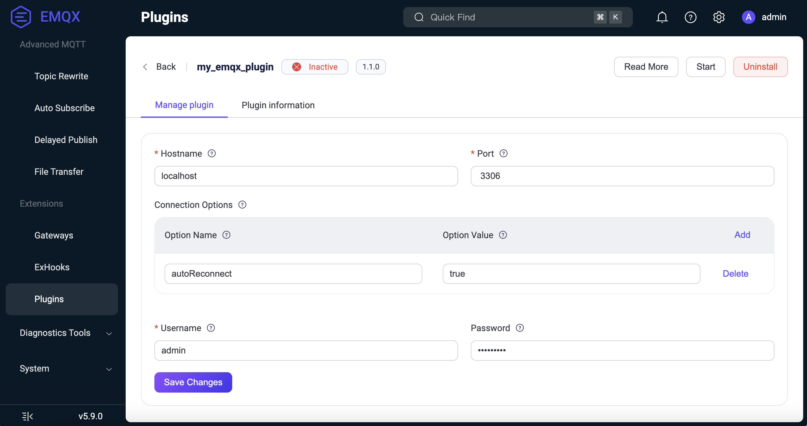
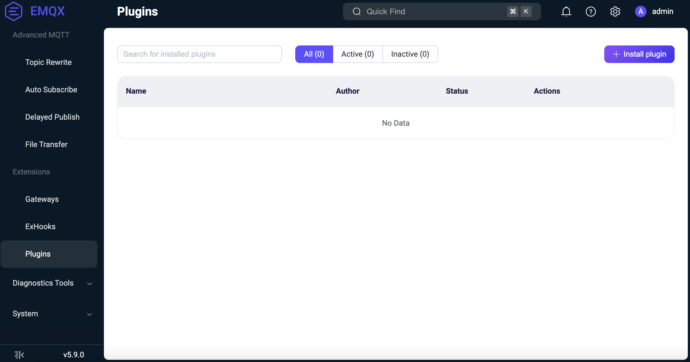
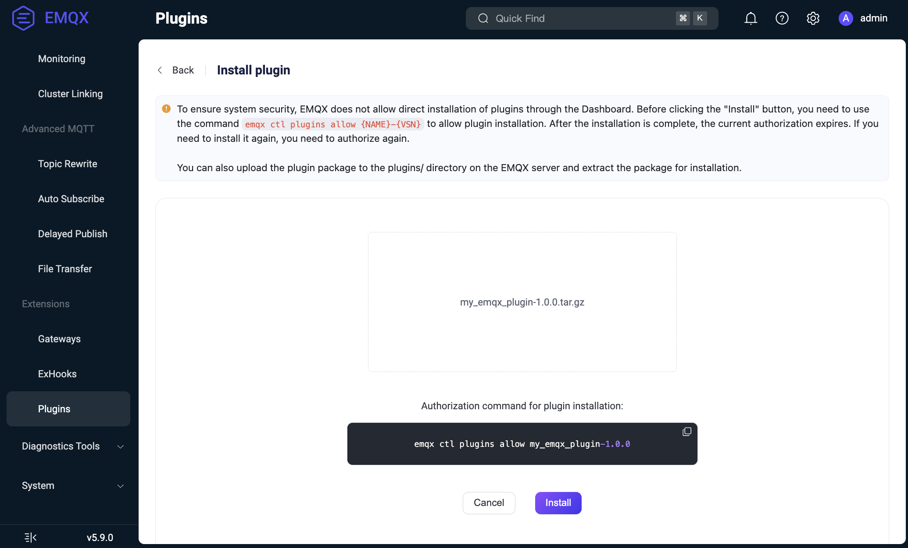
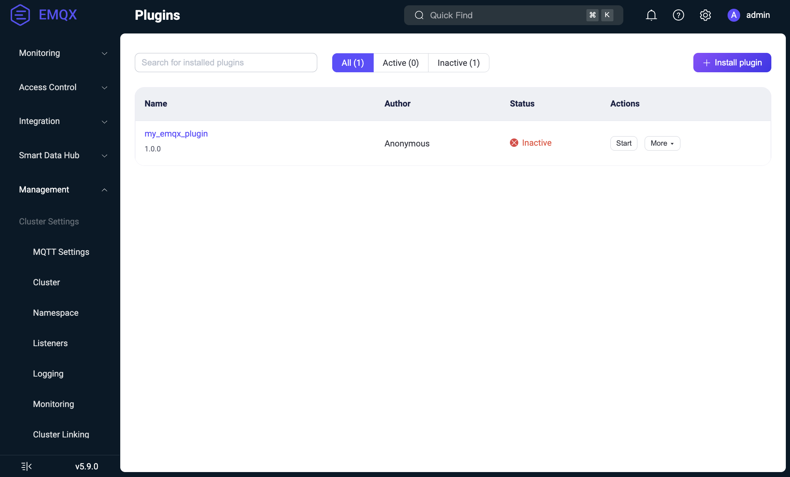

# EMQX Plugin Template

This is a [rebar3 template](https://rebar3.org/docs/tutorials/templates/#custom-templates) to ease creation of [EMQX](https://github.com/emqx/emqx) v5 Plugins in [Erlang](https://www.erlang.org/).

The documentation refers to the EMQX of the versions `~> 5.9`.

For EMQX `~> 4.3`, please see branch `emqx-v4`.

For older EMQX versions, plugin development is no longer maintained.

A plugin template for Elixir (experimental) can be found at https://github.com/emqx/emqx-elixir-plugin.

## What is a Plugin?

A plugin is an Erlang application that runs inside the EMQX nodes.

To be loaded into the nodes, a plugin must be compiled into a release (a single `.tar.gz` file). Then the release can be imported into EMQX using the Dashboard, REST API or CLI interfaces.

After being loaded, a plugin can be
* configured
* started/stopped
* unloaded

On startup, a plugin usually registers some of its functions as EMQX _callbacks_ to modify or extend EMQX behavior.

## Plugin development

### Prerequisites

 + A working build environment (e.g. `build_essential`) including `make`.
 + Erlang/OTP of the same major version as the EMQX release you want to target. See `org.opencontainers.image.otp.version` attribute of the docker, or refer to the `.tool-versions` file of the used version (e.g. https://github.com/emqx/emqx/blob/e5.9.0-beta.4/.tool-versions). We recommend using [ASDF](https://asdf-vm.com/) to manage your Erlang/OTP versions.
 + [rebar3](https://www.rebar3.org/)

### Plugin creation

To create a new plugin, `emqx-plugin-template` (this repository) should be installed as a `rebar3` template.

E.g. for a Linux system, the following commands should be executed:

```shell
$ mkdir -p ~/.config/rebar3/templates
$ pushd ~/.config/rebar3/templates
$ git clone https://github.com/emqx/emqx-plugin-template.git
$ popd
```

> [!NOTE]
> If the `REBAR_CACHE_DIR` environment variable has been set, the directory for templates should be `$REBAR_CACHE_DIR/.config/rebar3/templates`.
> [Here](https://github.com/erlang/rebar3/issues/2762) is a relevant issue.


Then, the plugin can be created with the following command:

```shell
$ rebar3 new emqx-plugin my_emqx_plugin
```

This will create a working skeleton of a plugin in the `my_emqx_plugin` directory with the same name.

To make a release of the plugin, the following command should be executed:

```shell
$ cd my_emqx_plugin
$ make rel
```

This will create the plugin release: `_build/default/emqx_plugin/my_emqx_plugin-1.0.0.tar.gz`. This package may be used for provisioning/installation of the plugin.

### Plugin structure

The plugin skeleton created by the `rebar3 new emqx-plugin` represents a single OTP application.

```
.
├── LICENSE
├── Makefile
├── priv
│   ├── ...
├── README.md
├── rebar.config
├── scripts
│   ├── ...
└── src
    ├── my_emqx_plugin_app.erl
    ├── my_emqx_plugin.app.src
    ├── my_emqx_plugin_cli.erl
    ├── my_emqx_plugin.erl
    └── my_emqx_plugin_sup.erl
```

* `src` - The code of the plugin's OTP application.
* `priv` - The directory for the plugin's configuration files and configuration schema. It contains some example files.
* `rebar.config` - The rebar3 configuration file used to build the application and pack it into a release.
* `Makefile` - The entry point for building the plugin.
* `scripts` - Helper scripts for the `Makefile`.
* `README.md` - Documentation placeholder.
* `LICENSE` - The plugin's sample license file.

#### `rebar.config`

The `rebar.config` file is used to build the plugin and pack it into a release.

The most important sections are
* dependencies (`deps`) section;
* release section (`relx`);
* plugin description (`emqx_plugin`) section.

In the `deps` section, you can add dependencies to other OTP applications that your plugin depends on.

```erlang
{deps,
    [
        ...
        %% this is my plugin's dependency
        {map_sets, "1.1.0"}
    ]}.
```

The skeleton adds a single extra dependency to the plugin: `map_sets`. It may be removed if not needed. See
[`rebar3` dependency documentation](https://www.rebar3.org/docs/configuration/dependencies/) for more details.

In the `relx` section, you specify the release name and version, and the list of applications to be included in the release.

```erlang
{relx, [ {release, {my_emqx_plugin, "1.0.0"},
            [ my_emqx_plugin
            , map_sets
            ]}
       ...
       ]}.
```

Normally, you would like to add the applications of the runtime dependencies from the `deps` section to the release.

The release name and version are important because they are used to identify the plugin when it is installed into EMQX. They form a single identifier for the plugin (`my_emqx_plugin-1.0.0`) by which it is addressed in the API or CLI.

In the plugin description section, you specify additional information about the plugin.

```erlang
{emqx_plugrel,
  [ {authors, ["Your Name"]}
  , {builder,
      [ {name, "Your Name"}
      , {contact, "your_email@example.cpm"}
      , {website, "http://example.com"}
      ]}
  , {repo, "https://github.com/emqx/emqx-plugin-template"}
  , {functionality, ["Demo"]}
  , {compatibility,
      [ {emqx, "~> 5.0"}
      ]}
  , {description, "Another amazing EMQX plugin"}
  ]
}
```

#### `src` directory

The `src` directory contains the code of the plugin's OTP application.

##### `my_emqx_plugin.app.src`

`my_emqx_plugin.app.src` is a standard Erlang application description file which is compiled into `my_emqx_plugin.app` file in the release.

Note the following:
* The version of the application has nothing to do with the release version and may follow a different convention.
The version of the plugin is specified in the `rebar.config` file.
* Pay attention to the `applications` section. Since the plugin is an OTP application, plugin's start/stop/restart is
the respective operation on the plugin's application. So, if the plugin's application depends on other applications,
it should list them in the `applications` section.

##### `my_emqx_plugin_app.erl`

`my_emqx_plugin_app.erl` is the main module of the plugin's OTP application implementing the [`application` behaviour](https://www.erlang.org/doc/man/application.html), mainly, `start/2` and `stop/1` functions used to start/stop the plugin's application and its supervison tree.

Normally, the following activities are performed in the `start/2` function:
* Hook into EMQX hookpoints.
* Register CLI commands.
* Start the supervision tree.

Optionally, the `_app.erl` module may implement the `on_config_changed/2` and `on_health_check/1` callback functions.
* `on_config_changed/2` is called when the plugin's configuration is changed via the Dashboard, API or CLI.
* `on_health_check/1` is called when the plugin's info is requested. A plugin may report its status from this function.

##### Other files

The `my_emqx_plugin_cli.erl` module implements the CLI commands of the plugin. When registered, CLI commands are may be called via `emqx ctl` command.

`my_emqx_plugin_sup.erl` implements a typical supervisor for the plugin.

`my_emqx_plugin.erl` is the main module of the plugin implementing the plugin's logic. In the skeleton, it implements several demonstrational hooks with simple logging. Any other modules may be added to the plugin.

> [!NOTE]
> The application modules and files may be arbitrarily named with the only requirements:
> * The application name must be the same as the plugin name.
> * The application module (`_app`) must be named as `{plugin_name}_app`.

#### `priv` directory

The `priv` directory contains the files for the plugin's configuration and configuration schema.

In the skeleton, sample files are provided for them.

##### `config.hocon`

The `config.hocon` file contains the plugin's initial configuration, i.e. the configuration that is used when the plugin is installed. It is written in [HOCON format](https://github.com/lightbend/config/blob/master/HOCON.md).

You could use `config.hocon.example` for a quick reference.

##### `config_schema.avsc`

The `config_schema.avsc` file contains the schema of the plugin's configuration. It is written in [Avro](https://avro.apache.org/docs/1.11.1/specification/) format.

If this file is present, then any time the plugin's configuration is to be updated, EMQX will validate the new configuration and reject it if it does not match the schema. See `config_schema.avsc.example`.

Also, the building the release will fail if the vendored `config.hocon` file does not conform to the schema.

Additionally, the `config_schema.avsc` file may contain UI hints for the configuration. Then it will be possible to interactively configure the plugin's parameters via the EMQX Dashboard. See `config_schema.avsc.enterprise.example` for the reference.

##### `config_i18n.json`

The `config_i18n.json` file contains the translations for the plugin's configuration UI. It is written in JSON format:

```json
{
  "$key": {
    "zh": "中文翻译",
    "en": "English translation"
  },
  ...
}
```

The translations may be referenced in the `config_schema.avsc` in UI hints. See `config_i18n.json.example` and `config_schema.avsc.enterprise.example`.

### Package structure

When a plugin is built into a release, the package structure is as follows:

```
└── my_emqx_plugin-1.1.0.tar.gz
    ├── map_sets-1.1.0
    ├── my_emqx_plugin-0.1.0
    ├── README.md
    └── release.json
```

I.e. the tarball contains the compiled applications (listed in the `relx` section of the `rebar.config` file), `README.md` and `release.json` file which contains various plugin metadata:

```json
{
    "hidden": false,
    "name": "my_emqx_plugin",
    "description": "Another amazing EMQX plugin.",
    "authors": "Anonymous",
    "builder": {
        "name": "Anonymous",
        "contact": "anonymous@example.org",
        "website": "http://example.com"
    },
    "repo": "https://github.com/emqx/emqx-plugin-template",
    "functionality": "Demo",
    "compatibility": {
        "emqx": "~> 5.7"
    },
    "git_ref": "unknown",
    "built_on_otp_release": "27",
    "emqx_plugrel_vsn": "0.5.1",
    "git_commit_or_build_date": "2025-04-29",
    "metadata_vsn": "0.2.0",
    "rel_apps": [
        "my_emqx_plugin-0.1.0",
        "map_sets-1.1.0"
    ],
    "rel_vsn": "1.1.0",
    "with_config_schema": true
}
```

## Plugin lifecycle

A plugin has three main states in EMQX:
* `installed` - the plugin is installed, its configuration and code are loaded, but the plugin's application is not started.
* `started` - the plugin is installed and its application is started.
* `uninstalled` - the plugin is uninstalled.

### Installation

The installation process is as follows:

1. The plugin package (the tarball created by the `make rel` command) is uploaded via the Dashboard, API or CLI.
2. The plugin package is transferred to each node of the EMQX cluster.
3. On each node:
    * The plugin package saved in the `plugins` subdirectory in the EMQX root directory (this may be overridden by the `plugins.install_dir` option): `$EMQX_ROOT/plugins/my_emqx_plugin-1.0.0.tar.gz`
    * The plugin package is unpacked into the same directory: `$EMQX_ROOT/plugins/my_emqx_plugin-1.0.0/`.
    * The plugin's initial configuration (`config.hocon` from the main plugin's app) is copied into the `$EMQX_DATA_DIR/plugins/my_emqx_plugin/config.hocon` file.
    * The plugin config's avro schema is loaded (if present).
    * The plugin's code is loaded into the node, but not started.
    * The plugin is registered as `disabled` in the EMQX config (`plugins.states`).

> [!NOTE]
> For plugins, only plugin states (`true` or `false` for the `enable` flag) reside in the EMQX config. The plugin's
configuration is stored in the `$EMQX_DATA_DIR/plugins/my_emqx_plugin/config.hocon` file on the nodes.

### Configuration

After the plugin is installed, it may be configured via the Dashboard or API. On configuration change

* The configuration is validated against the avro schema (if present).
* The new configuration is sent to the nodes of the EMQX cluster.
* The plugin's `on_config_changed/2` callback function is called. If the plugin accepts the new configuration, it is persisted in the `$EMQX_DATA_DIR/plugins/my_emqx_plugin/config.hocon` file.

> [!NOTE]
> `on_config_changed/2` callback function is called even if the application is not started.

> [!NOTE]
> `on_config_changed/2` callback function is called on each node of the EMQX cluster. So avoid implementing checks that may succeed or fail depending on the environment, e.g. do not check if some network resource is available. This may result to a situation when some nodes receive new configuration while others don't. Instead, use the `on_health_check/1` callback function for such checks and report unhealthy status if some resource is not available.

### Starting the plugin

The plugin is started manually via the Dashboard, API, or CLI. On start,
* The plugin's applications is started.
* The plugin is registered as `enabled` in the EMQX config (`plugins.states`).

When the plugin is started and its information is requested, the `on_health_check/1` callback function is called to retreive the plugin's status.

### Stopping the plugin

When the plugin is stopped,
* The plugin's applications are stopped.
* The plugin is registered as `disabled` in the EMQX config (`plugins.states`).

The plugin's code still remains loaded into the node, because a stopped plugin is still may be configured.

### Uninstallation

The uninstallation process is the following:

1. The plugin is stopped (if it is running).
2. The plugin's code is unloaded from the node.
3. The plugin's package files are removed from the nodes (the config file is preserved).
4. The plugin is unregistered in the EMQX config (`plugins.states`).

### Joining the cluster

When an EMQX node joins the cluster it may not have the actual plugins installed and configured since the plugins and their configs reside in the local file systems of the nodes.

The new node does the following:

* When a node joins the cluster, it obtains the global EMQX config (as a part of the cluster join process).
* From the EMQX config, it knows plugin statuses (which plugins are installed and which are enabled).
* The new node requests the plugins and their actual configs from other nodes.
* The new node installs plugins and starts the enabled ones.

## Implementing a Plugin

To implement a plugin, we usually need to implement the following logic.

* Implementing hooks and CLI commands.
* Handling configuration updates.
* Handling health checks.

### Implementing hooks and CLI commands

For certain events in EMQX, hookpoints are defined. Any application (including a plugin) may register callbacks for these hookpoints to react to the events and maybe alter the default behavior.

The most useful hookpoints are exposed in the skeleton file. The full list of hookpoints with their arguments and expected return values is available in [EMQX code](https://github.com/emqx/emqx/blob/master/apps/emqx/src/emqx_hookpoints.erl).

To register a callback for a hookpoint, we need to call the `emqx_hooks:add/3` function.
We provide:
* The hookpoint name.
* The callback module and function, maybe with some arguments that will be passed from EMQX to the callback as the last arguments.
* The priority of the callback. We usually use `?HP_HIGHEST` priority to be called first.

To unregister a callback, we need to call the `emqx_hooks:del/2` function providing the hookpoint name and the callback module and function.

For example, to register/unregister callbacks for the `client.authenticate` and `client.authorize` hookpoints, we may use the following code:

```erlang
-module(my_emqx_plugin).
...
hook() ->
  emqx_hooks:add('client.authenticate', {?MODULE, on_client_authenticate, []}, ?HP_HIGHEST),
  emqx_hooks:add('client.authorize', {?MODULE, on_client_authorize, []}, ?HP_HIGHEST).

unhook() ->
  emqx_hooks:del('client.authenticate', {?MODULE, on_client_authenticate}),
  emqx_hooks:del('client.authorize', {?MODULE, on_client_authorize}).
```

Usually we want the hooks to be enabled/disabled together with the plugin, so we call hook/unhook in the `start/2` and `stop/1` functions of the plugin's application. E.g.

```erlang
start(_StartType, _StartArgs) ->
    {ok, Sup} = my_emqx_plugin_sup:start_link(),
    my_emqx_plugin:hook(),

    {ok, Sup}.

stop(_State) ->
    my_emqx_plugin:unhook().
```

From the hookpoint specification, we know the [signature of the callback functions](https://github.com/emqx/emqx/blob/master/apps/emqx/src/emqx_hookpoints.erl).

```erlang
-callback 'client.authorize'(
    emqx_types:clientinfo(), emqx_types:pubsub(), emqx_types:topic(), allow | deny
) ->
    fold_callback_result(#{result := allow | deny, from => term()}).

-callback 'client.authenticate'(emqx_types:clientinfo(), ignore) ->
    fold_callback_result(
        ignore
        | ok
        | {ok, map()}
        | {ok, map(), binary()}
        | {continue, map()}
        | {continue, binary(), map()}
        | {error, term()}
    ).
```

So we may implement some callback functions in the following way:

```erlang
%% Only allow connections with client IDs that match any of the characters: A-Z, a-z, 0-9, and underscore.
on_client_authenticate(_ClientInfo = #{clientid := ClientId}, Result) ->
  case re:run(ClientId, "^[A-Za-z0-9_]+$", [{capture, none}]) of
    match -> {ok, Result};
    nomatch -> {stop, {error, banned}}
  end.
%% Clients can only subscribe to topics formatted as /room/{clientid}, but can send messages to any topics.
on_client_authorize(_ClientInfo = #{clientid := ClientId}, subscribe, Topic, Result) ->
  case emqx_topic:match(Topic, <<"/room/", ClientId/binary>>) of
    true -> {ok, Result};
    false -> stop
  end;
on_client_authorize(_ClientInfo, _Pub, _Topic, Result) -> {ok, Result}.
```

In the skeleton app, we register sample hooks via `my_emqx_plugin:load/1` and unregister them via `my_emqx_plugin:unload/0` functions.

### Handling configuration updates

When a user changes the plugin's configuration, the `on_config_changed/2` callback function of the plugin's application module is called.

Normally, we need to implement the following responsibilities in the `on_config_changed/2` callback function:
* Validate the new configuration.
* React to the configuration changes if the plugin is running.

When validating the new configuration, we need take into account that the apllication may not be started yet. So we should use mostly stateless checks. We should also avoid checks depending on the environment, because the environment may be different on different nodes.

To react to the configuration changes, we should only do something if the plugin is running.

So the pattern is usually the following:

* On application start, we start some `gen_server` process to handle the configuration.
* The process is registered under some name, e.g. `my_emqx_plugin_config_server`.
* The process reads the current configuration on start (see `my_emqx_plugin:get_config/0` in the skeleton app)
and initializes its state.
* `on_config_changed/2` callback function
    ** validates the new configuration
    ** casts a message to the `my_emqx_plugin_config_server` with the new configuration.
* The `my_emqx_plugin_config_server` process
    ** if started, updates its state and reacts to the configuration changes
    ** if stopped (together with the application), nothing happens.

### Handling health checks

The `on_health_check/1` callback function is called when the plugin's info is requested. A plugin may report its status from this function.

If a plugin uses some external resources that may be unavailable, the function is a good place to inform EMQX about their availability.

The function should return either
* `ok` - if the plugin is healthy;
* `{error, Reason}` with binary reason describing the problem if the plugin is unhealthy.

See `my_emqx_plugin_app:on_health_check/1` in the skeleton app.

> [!NOTE]
> Although the function is called only for the running plugins, it also may be called for starting/stopping plugins due to concurrency.

## Declarative UI Description (Optional)

If a plugin provides an avro schema for config validation, it may enrich the avro schema with UI declarations using the special `ui` field.

Declarative UI components enable dynamic form rendering within the Dashboard, accommodating a variety of field types and custom components. Below is a description of the available components and their configurations.

UI declarations are used for dynamic form rendering, allowing the EMQX Dashboard to dynamically generate configuration forms, making it easier to configure and manage plugins. Various field types and custom components are supported. Below are the available components and their configuration descriptions.

For example, for the following config:

```
hostname = "localhost"
port = 3306

connectionOptions = [
  {
    optionName = "autoReconnect"
    optionType = "string"
    optionValue = "true"
  }
]

auth {
  username = "admin"
  password {
    string = "Public123"
  }
}
```

We may provide schema and UI hints (see `priv/config_schema.avsc.enterprise.example`) to have a dynamic form rendered in the Dashboard:



See [docs/ui_declarations.md](docs/ui_declarations.md) for more details.

## Plugin installation

We assume that the plugin is already built and the tarball `my_emqx_plugin-1.0.0.tar.gz` is available.

### Using CLI

To install the plugin using CLI we to do the following.

On an EMQX node, copy the tarball to the EMQX plugins directory:

```shell
$ cp my_emqx_plugin-1.0.0.tar.gz $EMQX_HOME/plugins
```

Then, install the plugin:

```shell
$ emqx ctl plugins install my_emqx_plugin-1.0.0
```

Check plugin list:

```shell
$ emqx ctl plugins list
```

Start/stop the plugin:

```shell
$ emqx ctl plugins start my_emqx_plugin-1.0.0
$ emqx ctl plugins stop my_emqx_plugin-1.0.0
```

Uninstall the plugin:

```shell
$ emqx ctl plugins uninstall my_emqx_plugin-1.0.0
```

### Using Dashboard

For security reasons, even when installing a plugin from the Dashboard, we need to allow the installation with a CLI command.

On an EMQX node, run the following command:

```shell
$ emqx ctl plugins allow my_emqx_plugin-1.0.0
```

Then open the Dashboard and navigate to the "Plugins" page (Menu -> Cluster Settings -> Extensions -> Plugins).



Click on the "Install" button and select the `my_emqx_plugin-1.0.0.tar.gz` file.



Note that there is an additional hint about the CLI command to allow the installation.

Click on the "Install". You will see the list of plugins with the new plugin installed.



Now you can start/stop the plugin, configure it, etc.

### Using API

To install the plugin using API, we need to do the following.

First, allow the installation:

```shell
emqx ctl plugins allow my_emqx_plugin-1.0.0
```

Then, install the plugin:

```bash
$ curl -u $KEY:$SECRET -X POST http://$EMQX_HOST:18083/api/v5/plugins/install -H "Content-Type: multipart/form-data" -F "plugin=@my_emqx_plugin-1.0.0.tar.gz"
```

Check plugin list:

```bash
$ curl -u $KEY:$SECRET http://$EMQX_HOST:18083/api/v5/plugins | jq
```

Start/stop the plugin:

```bash
$ curl -s -u $KEY:$SECRET -X PUT "http://$EMQX_HOST:18083/api/v5/plugins/my_emqx_plugin-1.0.0/start"
$ curl -s -u $KEY:$SECRET -X PUT "http://$EMQX_HOST:18083/api/v5/plugins/my_emqx_plugin-1.0.0/stop"
```

## Plugin Upgrade

EMQX does not allow several versions of the same plugin to be installed at the same time.

So, to install a new version of the plugin,

* The old version is uninstalled.
* The new version installed.

The configuration is preserved between the installations.


